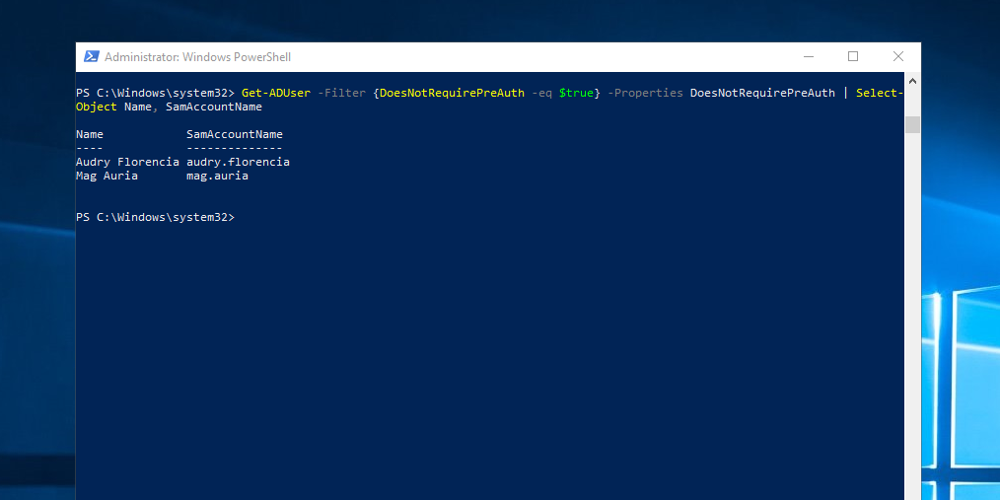
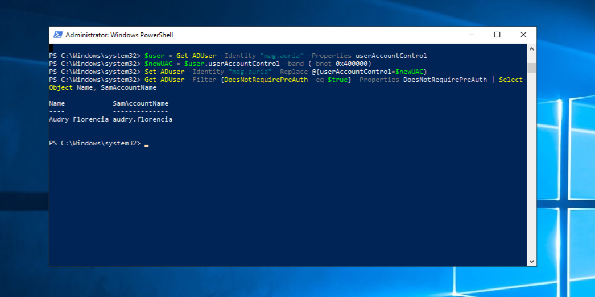

# 🔵 Detection and Response: AS-REP Roasting

While testing AS-REP Roasting in my lab, I used Splunk Enterprise to monitor for signs of the attack. The goal was to detect Kerberos TGT requests that didn’t require pre-authentication, which is unusual in a typical environment.

## 🎯 Detection Focus
- **Event ID:** 4768 (Kerberos authentication ticket requested)
- **Pre-Authentication Type:** 0 (pre-auth was not required)
- **Client Address:** Not a domain-joined host

---

## 📊 Splunk SPL
```
index=windows_logs EventCode=4768 | stats count by Account_Name, Client_Address, Pre_Authentication_Type
```
This query highlighted the exact moment the impacket script was used. The accounts being targeted matched the user enumeration file on my attackbox.


---

## 🧠 Observations
- Multiple 4768 events in a short burst
- Pre-Authentication Type set to 0
- Source IP was outside the domain
- Logon time must be noted if outside working hours

---

## 🛡️ Detection Plan
Create a correlation search to alert when:
- A 4768 log has Pre-Authentication Type 0
- AND the source is not a domain-joined asset

This should help flag AS-REP roasting early

---

## 🧹 Hardening Steps
After seeing how exposed this is, I’ll be auditing the domain for accounts with "Do not require Kerberos pre-authentication" enabled. That’s the main misconfig that makes AS-REP roasting possible.

Using elevated PowerShell on the Domain Controller, I list accounts that have Kerberos pre-authentication disabled
```
Get-ADUser -Filter {DoesNotRequirePreAuth -eq $true} -Properties DoesNotRequirePreAuth | Select-Object Name, SamAccountName
```


If vulnerable accounts are found, I fix them by changing the userAccountControl value to remove the DONT_REQ_PREAUTH flag
```
$user = Get-ADUser -Identity "mag.auria" -Properties userAccountControl
$newUAC = $user.userAccountControl -band (-bnot 0x400000)
Set-ADUser -Identity "mag.auria" -Replace @{userAccountControl=$newUAC}
```


I made sure to repeat these steps for each exposed account to protect against AS-REP Roasting. In my experience, the accounts that end up vulnerable this way are usually old service or test accounts. They don’t always pose a huge risk, especially if the domain is audited regularly. That said, I think leaving a honeypot account intentionally exposed like this could be really useful in a detection-focused setup, it might catch early recon activity before any real credentials are at risk.


---


